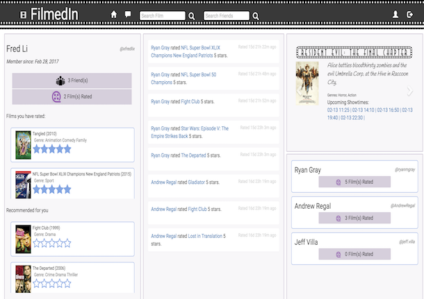

# filmedin
A social network for movie lovers.



### Getting Started
To get started, simply clone or fork and clone the repo 

Next open your terminal (you'll need two windows or tabs), navigate to the project folder, and type in the following scripts:

```javascript
npm install 
```

Then:
```javascript
live-server
```

And enjoy!
